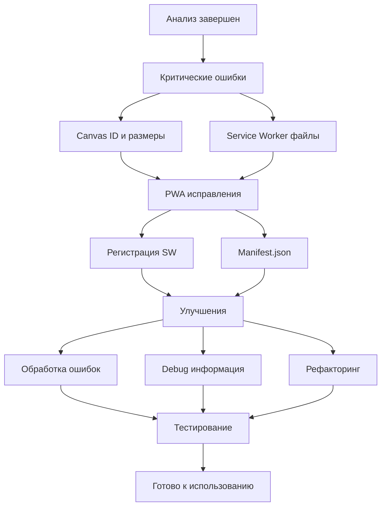
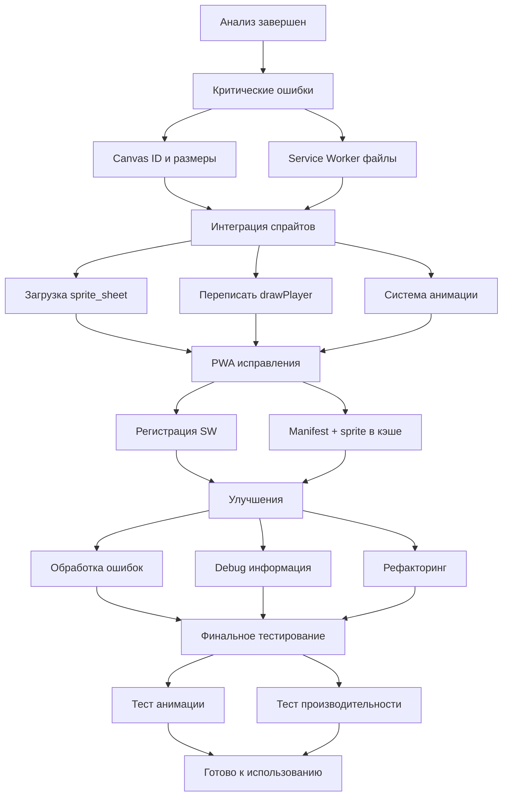

# 🔧 План исправления ошибок игры Shashkin Jump

## 🎯 Цель
Исправить все критические и некритические ошибки, обнаруженные при анализе кода игры.

---

## 📋 Этап 1: Исправление КРИТИЧЕСКИХ ошибок

### Задача 1.1: Исправить ID canvas в index.html

**Файл:** [`index.html`](index.html:262)  
**Что делать:**
- Заменить `id="spriteCanvas"` на `id="gameCanvas"` в строке 224
- Удалить инлайн-стили `transform: scale(0.33)` из canvas

**Код до исправления:**
```html
<canvas id="spriteCanvas" width="257" height="507" 
        style="position: absolute; top: 0; left: 0; z-index: 1; 
               transform: scale(0.33); transform-origin: top left;">
</canvas>
```

**Код после исправления:**
```html
<canvas id="gameCanvas" width="480" height="800"></canvas>
```

---

### Задача 1.2: Исправить размеры canvas

**Файл:** [`index.html`](index.html:224)  
**Что делать:**
- Изменить атрибуты `width` и `height` с 257×507 на 480×800
- Это соответствует размерам в JavaScript коде (строки 279-283)

---

### Задача 1.3: Обновить список кэшируемых файлов в Service Worker

**Файл:** [`sw.js`](sw.js:2)  
**Что делать:**
- Удалить несуществующие файлы из массива `urlsToCache`
- Добавить реально существующие файлы

**Код до исправления:**
```javascript
const urlsToCache = [
  '/',
  '/index.html',
  '/style.css',      // ❌ Не существует
  '/script.js',      // ❌ Не существует
  '/manifest.json',
  '/player.png',     // ❌ Не существует
  '/icon-192.png',   // ❌ Не существует
  '/icon-512.png'    // ❌ Не существует
];
```

**Код после исправления:**
```javascript
const urlsToCache = [
  '/',
  '/index.html',
  '/animation-demo.html',
  '/manifest.json',
  '/sprite_sheet.png',
  '/sprite/sprite1.png',
  '/sprite/sprite2.png',
  '/sprite/sprite3.png',
  '/sprite/sprite4.png',
  '/sprite/sprite5.png',
  '/sprite/sprite6.png'
];
```

---

## 📋 Этап 2: Исправление НЕКРИТИЧЕСКИХ проблем

### Задача 2.1: Добавить регистрацию Service Worker

**Файл:** [`index.html`](index.html:919)  
**Что делать:**
- Добавить код регистрации Service Worker перед закрывающим тегом `</script>`

**Добавить код:**
```javascript
// ======================
// РЕГИСТРАЦИЯ SERVICE WORKER
// ======================

if ('serviceWorker' in navigator) {
    window.addEventListener('load', () => {
        navigator.serviceWorker.register('/sw.js')
            .then(registration => {
                console.log('✅ Service Worker зарегистрирован:', registration.scope);
            })
            .catch(error => {
                console.log('❌ Ошибка регистрации Service Worker:', error);
            });
    });
}
```

**Позиция:** После строки 918, перед строкой 919

---

### Задача 2.2: Исправить значение FPS в animation-demo.html

**Файл:** [`animation-demo.html`](animation-demo.html:198)  
**Что делать:**
- Изменить начальное значение `fps` с 30 на 10

**Код до исправления:**
```javascript
let fps = 30;
```

**Код после исправления:**
```javascript
let fps = 10;
```

---

### Задача 2.3: Обновить manifest.json

**Файл:** [`manifest.json`](manifest.json:10)  
**Что делать:**
- Временно закомментировать или удалить ссылки на несуществующие иконки
- Добавить TODO для создания иконок в будущем

**Вариант 1 - Удалить секцию icons:**
```json
{
  "name": "Shashkin Jump",
  "short_name": "Shashkin Jump",
  "description": "Jump as high as you can in this fun casual game!",
  "start_url": "/",
  "display": "standalone",
  "background_color": "#87CEEB",
  "theme_color": "#FF6B6B",
  "orientation": "portrait",
  "categories": ["games", "entertainment"]
}
```

**Вариант 2 - Использовать placeholder (рекомендуется):**
Оставить текущую структуру, но создать файлы иконок позже в отдельной задаче.

---

## 📋 Этап 3: Дополнительные улучшения

### Задача 3.1: Добавить обработку ошибок

**Файл:** [`index.html`](index.html:262)  
**Что делать:**
- Добавить проверку существования canvas перед использованием

**Добавить после строки 262:**
```javascript
if (!canvas) {
    console.error('❌ Ошибка: Canvas с id="gameCanvas" не найден!');
    alert('Ошибка загрузки игры. Пожалуйста, обновите страницу.');
    throw new Error('Canvas element not found');
}
```

---

### Задача 3.2: Добавить debug информацию

**Файл:** [`index.html`](index.html:329)  
**Что делать:**
- Добавить console.log для отслеживания инициализации

**Добавить в начало функции init():**
```javascript
function init() {
    console.log('🎮 Инициализация игры...');
    console.log('Canvas размер:', canvas.width, 'x', canvas.height);
    console.log('Рекорд из localStorage:', highScore);
    
    // ... остальной код
}
```

---

### Задача 3.3: Улучшить читаемость кода

**Что делать:**
- Добавить больше комментариев к сложным участкам кода
- Группировать связанные функции
- Использовать константы для магических чисел

**Примеры улучшений:**
```javascript
// Константы физики игры
const PHYSICS = {
    JUMP_POWER: -16,
    GRAVITY: 0.6,
    MAX_FALL_SPEED: 20,
    PLAYER_SPEED: 8,
    CAMERA_THRESHOLD: 300
};

// Константы платформ
const PLATFORM = {
    WIDTH: 80,
    HEIGHT: 20,
    MIN_Y_GAP: 90,
    MAX_Y_GAP: 160
};
```

---

## ✅ Контрольный список исправлений

### Критические (блокируют работу игры):
- [ ] Исправить ID canvas в HTML (gameCanvas)
- [ ] Исправить размеры canvas (480×800)
- [ ] Обновить список файлов в Service Worker

### Важные (влияют на PWA):
- [ ] Добавить регистрацию Service Worker
- [ ] Обновить manifest.json (иконки)

### Улучшения:
- [ ] Исправить FPS в animation-demo
- [ ] Добавить обработку ошибок
- [ ] Добавить debug информацию
- [ ] Улучшить читаемость кода

---

## 🧪 План тестирования после исправлений

### 1. Базовая функциональность:
- [ ] Игра запускается без ошибок в консоли
- [ ] Canvas отображается корректно
- [ ] Управление работает (клавиатура и сенсорное)
- [ ] Персонаж прыгает и падает правильно
- [ ] Коллизии с платформами работают
- [ ] Счет обновляется

### 2. PWA функционал:
- [ ] Service Worker регистрируется успешно
- [ ] Файлы кэшируются
- [ ] Игра работает в офлайн режиме (после первой загрузки)
- [ ] Manifest.json без ошибок

### 3. Анимационная демонстрация:
- [ ] animation-demo.html работает корректно
- [ ] FPS отображается правильно (10)
- [ ] Анимация плавная

---

## 📝 Порядок выполнения

1. **Сначала исправить критические ошибки** (Этап 1)
   - Это позволит игре вообще запуститься
   
2. **Затем исправить проблемы PWA** (Этап 2, задачи 2.1 и 2.3)
   - Это обеспечит корректную работу PWA
   
3. **Финально - улучшения** (Этап 2, задача 2.2 и Этап 3)
   - Это улучшит качество кода и UX

---

## 🎨 Диаграмма приоритетов



---

## 🚀 Следующие шаги после исправлений

1. **Создание иконок для PWA:**
   - icon-192.png
   - icon-512.png
   - screenshot1.png

2. **Интеграция sprite sheet в основную игру:**
   - Заменить примитивную отрисовку персонажа на анимированный спрайт

3. **Оптимизация производительности:**
   - Проверить FPS на мобильных устройствах
   - Оптимизировать отрисовку частиц

4. **Добавление звуковых эффектов:**
   - Звук прыжка
   - Звук сбора монет
   - Фоновая музыка

---

## 🎨 Этап 4: Интеграция Sprite Sheet персонажа

### Задача 4.1: Подготовить систему загрузки спрайтов

**Файл:** [`index.html`](index.html:250)  
**Что делать:**
- Добавить загрузку sprite_sheet.png после объявления canvas
- Создать константы для работы со спрайтами

**Добавить после строки 263:**
```javascript
// ======================
// ЗАГРУЗКА SPRITE SHEET
// ======================

const spriteSheet = new Image();
spriteSheet.src = 'sprite_sheet.png';

// Константы спрайтов
const SPRITE = {
    COLS: 3,
    ROWS: 2,
    FRAME_WIDTH: 257,
    FRAME_HEIGHT: 507,
    FRAMES: {
        IDLE: 0,      // Стойка
        CROUCH: 1,    // Присед
        JUMP: 2,      // Прыжок
        FLY: 4,       // Полёт
        FALL: 5       // Падение с облачком
    }
};

let currentSpriteFrame = 0;
let spriteLoaded = false;

spriteSheet.onload = function() {
    spriteLoaded = true;
    console.log('✅ Sprite sheet загружен');
};

spriteSheet.onerror = function() {
    console.error('❌ Ошибка загрузки sprite sheet');
};
```

---

### Задача 4.2: Заменить функцию drawPlayer()

**Файл:** [`index.html`](index.html:746)  
**Что делать:**
- Полностью переписать функцию отрисовки персонажа
- Использовать sprite sheet вместо примитивов

**Код до исправления:**
```javascript
function drawPlayer() {
    const y = player.y - cameraY;
    
    // Тело
    ctx.fillStyle = player.facingRight ? '#FF6B6B' : '#4ECDC4';
    ctx.fillRect(player.x, y, player.width, player.height * 0.8);
    
    // ... остальной примитивный код
}
```

**Код после исправления:**
```javascript
function drawPlayer() {
    const y = player.y - cameraY;
    
    // Если спрайт не загружен, показываем заглушку
    if (!spriteLoaded) {
        ctx.fillStyle = '#4ECDC4';
        ctx.fillRect(player.x, y, player.width, player.height);
        return;
    }
    
    // Определить нужный кадр на основе состояния игрока
    if (player.onPlatform) {
        currentSpriteFrame = SPRITE.FRAMES.IDLE;
    } else if (player.velY < -5) {
        currentSpriteFrame = SPRITE.FRAMES.JUMP;
    } else if (player.velY > 5) {
        currentSpriteFrame = SPRITE.FRAMES.FALL;
    } else {
        currentSpriteFrame = SPRITE.FRAMES.FLY;
    }
    
    // Вычислить позицию кадра в sprite sheet
    const col = currentSpriteFrame % SPRITE.COLS;
    const row = Math.floor(currentSpriteFrame / SPRITE.COLS);
    
    // Сохранить контекст для отражения спрайта
    ctx.save();
    
    // Отразить по горизонтали если нужно
    if (!player.facingRight) {
        ctx.translate(player.x + player.width, y);
        ctx.scale(-1, 1);
        ctx.drawImage(
            spriteSheet,
            col * SPRITE.FRAME_WIDTH,
            row * SPRITE.FRAME_HEIGHT,
            SPRITE.FRAME_WIDTH,
            SPRITE.FRAME_HEIGHT,
            0,
            0,
            player.width,
            player.height
        );
    } else {
        ctx.drawImage(
            spriteSheet,
            col * SPRITE.FRAME_WIDTH,
            row * SPRITE.FRAME_HEIGHT,
            SPRITE.FRAME_WIDTH,
            SPRITE.FRAME_HEIGHT,
            player.x,
            y,
            player.width,
            player.height
        );
    }
    
    ctx.restore();
}
```

---

### Задача 4.3: Настроить плавную анимацию

**Файл:** [`index.html`](index.html:296)  
**Что делать:**
- Добавить переменные для анимации кадров
- Сделать плавные переходы между состояниями

**Добавить в секцию игровых переменных (после строки 294):**
```javascript
// Анимация спрайтов
let spriteAnimationTimer = 0;
let spriteAnimationSpeed = 5; // Кадров до смены
```

**Обновить в функции update() (добавить перед checkPlatformCollision):**
```javascript
// Обновление анимации спрайтов
spriteAnimationTimer++;
if (spriteAnimationTimer >= spriteAnimationSpeed) {
    spriteAnimationTimer = 0;
}
```

---

### Задача 4.4: Добавить визуальные эффекты

**Файл:** [`index.html`](index.html:788)  
**Что делать:**
- Добавить эффект при приземлении (облачко пыли уже есть в спрайте)
- Опционально: добавить след при движении

**Опциональный код (добавить в drawPlayer после отрисовки спрайта):**
```javascript
// Эффект следа при быстром движении
if (Math.abs(player.velX) > 5) {
    ctx.globalAlpha = 0.3;
    ctx.fillStyle = '#FFFFFF';
    ctx.fillRect(player.x + player.width/2 - 2, y + player.height - 10, 4, 8);
    ctx.globalAlpha = 1.0;
}
```

---

## ✅ Обновленный контрольный список

### Критические (блокируют работу игры):
- [ ] Исправить ID canvas в HTML (gameCanvas)
- [ ] Исправить размеры canvas (480×800)
- [ ] Обновить список файлов в Service Worker

### Важные (влияют на PWA):
- [ ] Добавить регистрацию Service Worker
- [ ] Обновить manifest.json (иконки)

### Улучшения:
- [ ] Исправить FPS в animation-demo
- [ ] Добавить обработку ошибок
- [ ] Добавить debug информацию
- [ ] Улучшить читаемость кода

### 🎨 Интеграция спрайтов (НОВОЕ):
- [ ] Загрузить sprite_sheet.png
- [ ] Создать константы SPRITE
- [ ] Переписать функцию drawPlayer()
- [ ] Добавить систему анимации кадров
- [ ] Настроить отражение спрайта (facingRight/Left)
- [ ] Добавить fallback на случай ошибки загрузки
- [ ] Протестировать все состояния (прыжок, падение, стойка)

---

## 🧪 Обновленный план тестирования

### 1. Базовая функциональность:
- [ ] Игра запускается без ошибок в консоли
- [ ] Canvas отображается корректно
- [ ] Управление работает (клавиатура и сенсорное)
- [ ] Персонаж прыгает и падает правильно
- [ ] Коллизии с платформами работают
- [ ] Счет обновляется

### 2. PWA функционал:
- [ ] Service Worker регистрируется успешно
- [ ] Файлы кэшируются (включая sprite_sheet.png)
- [ ] Игра работает в офлайн режиме
- [ ] Manifest.json без ошибок

### 3. Анимация персонажа (НОВОЕ):
- [ ] Sprite sheet загружается корректно
- [ ] Персонаж отображается вместо примитивов
- [ ] Анимация меняется при прыжке
- [ ] Анимация меняется при падении
- [ ] Анимация меняется на платформе
- [ ] Отражение работает (left/right)
- [ ] Производительность не снизилась
- [ ] Нет визуальных артефактов

### 4. Анимационная демонстрация:
- [ ] animation-demo.html работает корректно
- [ ] FPS отображается правильно (10)
- [ ] Анимация плавная

---

## 🎯 Обновленный порядок выполнения

1. **Исправить критические ошибки** (Этап 1)
   - Canvas ID и размеры
   - Service Worker файлы

2. **Интегрировать спрайты** (Этап 4) ⭐ НОВОЕ
   - Загрузка sprite sheet
   - Переписать drawPlayer()
   - Добавить анимацию

3. **Исправить PWA** (Этап 2)
   - Регистрация SW
   - Manifest.json
   - Кэширование sprite_sheet.png

4. **Финальные улучшения** (Этап 3)
   - FPS в demo
   - Обработка ошибок
   - Debug info

---

## 🎨 Обновленная диаграмма приоритетов



---

## 📸 Визуальное сравнение

### До интеграции спрайтов:
- Примитивный персонаж (квадраты)
- Один статичный вид
- Примитивная анимация рта

### После интеграции спрайтов:
- Детализированный персонаж в деловом костюме
- 6 кадров анимации
- Плавные переходы между состояниями
- Профессиональный внешний вид

---

## 🚀 Обновленные следующие шаги

1. **Создание иконок для PWA:**
   - icon-192.png (использовать кадр 1 из sprite)
   - icon-512.png (использовать кадр 1 из sprite)
   - screenshot1.png (скриншот игры с новым персонажем)

2. **Дополнительные улучшения анимации:**
   - Добавить промежуточные кадры (если нужно)
   - Реализовать idle-анимацию (покачивание)
   - Добавить анимацию сбора монет

3. **Оптимизация:**
   - Проверить размер sprite_sheet.png (сжать если нужно)
   - Рассмотреть использование отдельных спрайтов вместо sheet (для экономии памяти)

4. **Звуковые эффекты:**
   - Звук прыжка
   - Звук сбора монет
   - Фоновая музыка

---

**Дата создания плана:** 2 февраля 2026  
**Дата обновления:** 2 февраля 2026  
**Статус:** Готов к исполнению (обновлен с учетом спрайтов)
